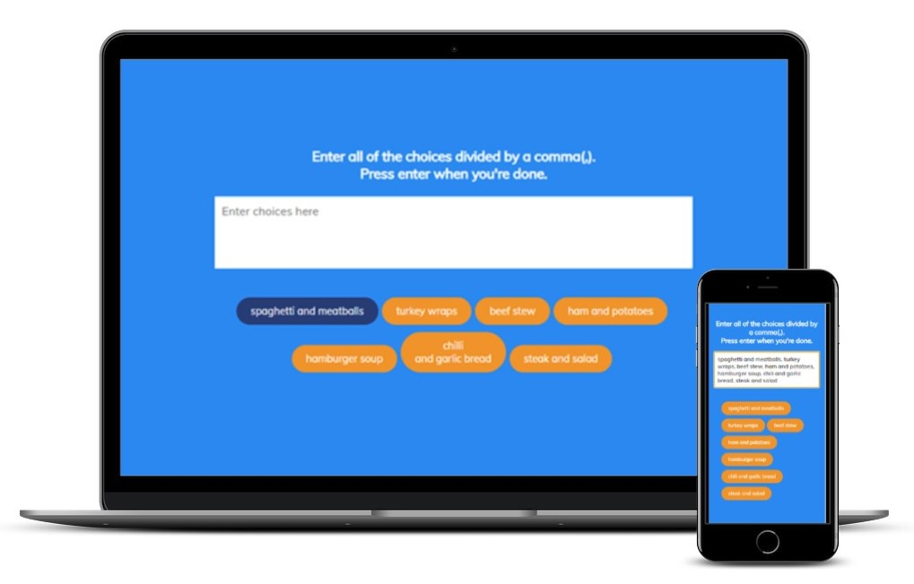

# Random Choice Picker

This is the Random Choice Picker project (Day 13) in the [Udemy course 50 projects in 50 Days](https://www.udemy.com/course/50-projects-50-days/?src=sac&kw=50+projects+50+days).

## Project Details

The goal of the project is to create an application that allows the user to input several options and then, upon completion of choice input, it randomly selects one of the options. Great for scenarios when the user is undecided and is looking for a random answer to the possible choices.

### View My Project: 

## Features

- Input the available options to choose from.
- Short animation occurs during the selection process, as the application goes over the available options.
- The input area for available choices is cleared upon initiation of the  random selection process.
- The selected option is identified by a permanent change in the background color of the chosen tag.

## Technologies Used

- HTML5
- CSS3
- JavaScript

## My Process

- Start the files from a boiler template.
- Add styles for the application.
- Grab the target elements.
- Utilize the focus() method to automatically have the cursor ready for input of choices.
- Add an event listener for the text area to activate each time there is a keyup event and grab the individual input with the event for use in the function to create tags.
- Create the function that will build each tag.
    * Grab the inputs seperated by a comma.
    * Split the inputs to create an array of choices.
    * Remove any empty strings and trim any white space.
    * Ensure each tag initiates as empty.
    * Create a span element for each input.
    * Add the class of tag to each span element.
    * Each tag will hold a single input value.
    * Add each input value to the array of tags.
- Inside the event listener for the text area (input of choices), add an if statement to watch for when the **Enter** key is selected
- Inside the if statement, when the **Enter** key is pressed:
    * Run the `setTimeout()` method which will clear the input area after 10 milliseconds.
    * Add a function `randomSelect()` to randomly select one of the choices 
- To create the function for the random selection of choices, we first need to create:
    1. A function to pick a tag that will be used during the animation of tags in the selection process and for the final answer display.
        * Here we target the tag elements.
        * Then utilize `Math.floor()`, `Math.random()`, and the length of the NodeList to return the tag specific index which will highlight a certain tag and eventually display the tag selected for the final answer.
    2. A function to highlight a specific tag during the animation process.
    3. A function to unhighlight the highlighted tag during the animation process.
- Now, we can create the function `randomSelect()` that will display animation during the selection process and result with a random selected choice:
    * Create a variable for the number of times we want each tag highlighted during the selection process before the completion of the animation.
    * Utilize the `setInterval()` method to run the animation during the selection process, highlighting and unhighlighting tags.
    * Use the `setTimeout()` method to stop the above animation and select a random option as the final choice, highlighting it as the answer.
- Update styles for responsiveness across multiple devices.

### Continued development

The use of the `setTimeout()` and `setInterval()` methods in this project enabled me to further enhance my understanding of these JavaScript methods and how they can be used in combination to achieve specific effects.

## Acknowledgements

Original Project idea: Brad Traversy, Florin Pop [Udemy course 50 Projects in 50 Days](https://www.udemy.com/course/50-projects-50-days/?src=sac&kw=50+projects+50+days)

Original HTML, CSS & Javascript provided by: Brad Traversy, Florin Pop [Udemy course 50 Projects in 50 Days](https://www.udemy.com/course/50-projects-50-days/?src=sac&kw=50+projects+50+days)
